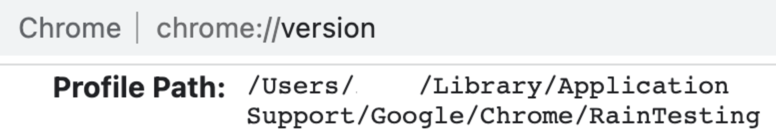
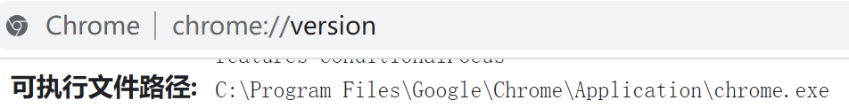
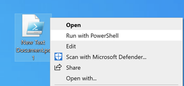

<!-- ## 需求


想要在 Google 浏览器上创建 50 个用户
 -->

## 需求

 新的电脑想要在 `Chrome` 上创建30个浏览器用户，并且每个用户都要装一些插件和进行一些设置
 
 一个一个创建浏览器用户再加上装插件和设置太慢了，整个下来差不多要接近一个小时的时间

后来找到一些方法可以实现几分钟就搞定上面的需求，接下来就说下如何通过命令实现这个需求

## 思路

浏览器每创建一个用户配置都会在本地存储目录下创建一个用户目录，目录名称为 `Profile 数字`
基于 Webkit 内核的浏览器默认情况下会有一个用户，这个用户对应的目录是 `Default`，后面创建的用户都会从 `Profile 1` 一直往后累加
如下所示：

```bash
.
└── Chrome/
    ├── Profile 1
    ├── Profile 2
    ├── Profile 3
    ├── Profile 4
    └── ...
```

浏览器也提供一些参数，可以通过命令+参加实现功能，通过 Shell 的循环来实现多个

## 本地存储目录



<!-- tab Google@fa-brands fa-chrome -->

macOS:

```bash
/Users/$USER/Library/Application Support/Google/Chrome
```

Windows ( cmd ):

```bat
C:\Users\%username%\AppData\Local\Google\Chrome\User Data
```

Windows ( PowerShell )
```powershell
C:\Users\$env:UserName\AppData\Local\Google\Chrome\User Data
```

Linux:

```bash
/home/$USER/.config/google-chrome
```

<!-- endtab -->

<!-- tab Microsoft Edge@fa-brands fa-edge -->

macOS:

```bash
/Users/$USER/Library/Application Support/Microsoft Edge
```

Windows ( cmd ):

```bat
C:\Users\%username%\AppData\Local\Microsoft\Edge\User Data
```

Windows ( PowerShell )
```powershell
C:\Users\$env:UserName\AppData\Local\Microsoft\Edge\User Data
```

Linux:

```bash
/home/$USER/.config/microsoft-edge
```

<!-- endtab -->

<!-- tab Brave -->

macOS:

```bash
/Users/$USER/Library/Application Support/BraveSoftware/Brave-Browser
```

Windows ( cmd ):

```bat
C:\Users\%username%\AppData\Local\BraveSoftware\Brave-Browser\User Data
```

Windows ( PowerShell )
```powershell
C:\Users\$env:UserName\AppData\Local\BraveSoftware\Brave-Browser\User Data
```

Linux:

```bash
/home/$USER/.config/BraveSoftware/Brave-Browser
```

<!-- endtab -->



## 使用命令创建用户

以 macOS 为例，先看一行命令

```bash
open -na "Google Chrome" --args --profile-directory="RainTesting"
```

这行命令是指新开一个 Chrome 实例，并以指定的用户打开，`--profile-directory` 参数后面的值就是用户目录的名称，这个名称可以任意填写，我们手动在浏览器中新增一个窗口，浏览器默认的新增的名称是 `Profile 数字`，后面的数字会依次往后累加

如果用户目录已经存在，则会直接打开指定用户并不会新增


可以在浏览器中访问以下网址查看用户目录
Google: [chrome://version/](chrome://version/)
Edge: [edge://version/](edge://version/)
Brave: [brave://version/](brave://version/)



Windows 的命令稍微有些不同，因为软件的安装路径有可能不同，所以先查看下路径
首先访问上面提到的网站，查看可执行文件的路径
如下图所示：




<!-- tab macOS@fa-brands fa-apple -->

Google:

```bash
open -na "Google Chrome" --args --profile-directory="Profile Testing"
```

Microsoft Edge:

```bash
open -na "Microsoft Edge" --args --profile-directory="Profile Testing"
```

Brave:

```bash
open -na "Brave Browser" --args --profile-directory="Profile Testing"
```

<!-- endtab -->
<!-- tab Windows ( cmd )@fa-brands fa-windows -->

Google:

```bat
"C:\Program Files\Google\Chrome\Application\chrome.exe" --profile-directory="Profile Testing"
```

Microsoft Edge:

```bat
"C:\Program Files (x86)\Microsoft\Edge\Application\msedge.exe" --profile-directory="Profile Testing"
```

Brave:

```bat
"C:\Program Files\BraveSoftware\Brave-Browser\Application\brave.exe" --profile-directory="Profile Testing"
```

<!-- endtab -->
<!-- tab Windows ( PowerShell )@fa-brands fa-windows -->
Google:

```powershell
Start-Process -FilePath "C:\Program Files\Google\Chrome\Application\chrome.exe" -ArgumentList "--profile-directory=`"Profile Testing`""
```

Microsoft Edge:

```powershell
Start-Process -FilePath "C:\Program Files (x86)\Microsoft\Edge\Application\msedge.exe" -ArgumentList "--profile-directory=`"Profile Testing`""
```
```

Brave:

```powershell
Start-Process -FilePath "C:\Program Files\BraveSoftware\Brave-Browser\Application\brave.exe" -ArgumentList "--profile-directory=`"Profile Testing`""
```

<!-- endtab -->
<!-- tab Linux@fa-brands fa-linux -->

Google:

```bash
google-chrome --profile-directory="Profile Testing"
```

Microsoft Edge:

```bash
microsoft-edge --profile-directory="Profile Testing"
```

Brave:

```bash
brave-browser --profile-directory="Profile Testing"
```

<!-- endtab -->



## 创建多个用户

在 macOS 和 Linux 下可以使用 Shell 的 for 循环， Windows 下可以用 PowerShell 或者是批处理

可以看下面的例子，中间的命令和上面创建单个用户是一样的，只是在外层加了个 for 循环，里面用变量名作为目录名称的一部分
循环的次数由 `{1..3}` 决定， 前面的1代表起始位置，后面的3代码结束位置，包含前后范围
这意味着下面的例子将会在目录中创建 Profile 1, Profile 2, Profile 3 三个文件夹
其他格式可以自行修改


创建多个用户时，需要注意下电脑性能，如果同时创建太多用户电脑性能不够可能会死机，建议这种情况下分批创建 
`Windows` 下建议使用 `PowerShell` 而不是 `批处理`
例如：创建三个用户，批处理一次只能创建一个，需要手动关闭窗口后才会继续往下创建




<!-- tab macOS@fa-brands fa-apple -->

Google:

```bash
for i in {1..3}
do
    open -na "Google Chrome" --args --profile-directory="Profile $i"
done
```

Microsoft Edge:

```bash
for i in {1..3}
do
    open -na "Microsoft Edge" --args --profile-directory="Profile $i"
done
```

Brave

```bash
for i in {1..3}
do
    open -na "Brave Browser" --args --profile-directory="Profile $i"
done
```

<!-- endtab -->

<!-- tab Windows ( Bat )@fa-brands fa-windows -->

Windows 下多行命令可以使用批处理文件，新建一个文件将后缀改为 `.bat`，然后编辑文件将以下代码复制到文件中保存后运行即可

括号中三个数字，前面的 `1` 代表起始位置，后面的 `3` 代表结束位置，包含前后范围

Google:
```bat
for /l %%i in (1, 1, 3) do (
   "C:\Program Files\Google\Chrome\Application\chrome.exe" --profile-directory="Profile %%i"
)
```

Microsoft Edge:
```bat
for /l %%i in (1, 1, 3) do (
   "C:\Program Files (x86)\Microsoft\Edge\Application\msedge.exe" --profile-directory="Profile %%i"
)
```

Brave
```bat
for /l %%x in (1, 1, 3) do (
   "C:\Program Files\BraveSoftware\Brave-Browser\Application\brave.exe" --profile-directory="Profile %%x"
)
```

<!-- endtab -->

<!-- tab Windows ( PowerShell )@fa-brands fa-windows -->

`$i = 1` 1 代表起始位置
`$i -le 3` 3 代表结束位置
包含前后范围

Google:
```powershell
for ($i = 1; $i -le 3; $i++) {
    Start-Process -FilePath "C:\Program Files\Google\Chrome\Application\chrome.exe" -ArgumentList "--profile-directory=`"Profile $i`""
}
```

Microsoft Edge:
```powershell
for ($i = 1; $i -le 3; $i++) {
    Start-Process -FilePath "C:\Program Files (x86)\Microsoft\Edge\Application\msedge.exe" -ArgumentList "--profile-directory=`"Profile $i`""
}
```

Brave
```powershell
for ($i = 1; $i -le 3; $i++) {
    Start-Process -FilePath "C:\Program Files\BraveSoftware\Brave-Browser\Application\brave.exe" -ArgumentList "--profile-directory=`"Profile $i`""
}
```

<!-- endtab -->

<!-- tab Linux@fa-brands fa-linux -->

Google:
```bash
for i in {1..3}
do
    google-chrome --profile-directory="Profile $i"
done
```

Microsoft Edge:
```bash
for i in {1..3}
do
    microsoft-edge --profile-directory="Profile $i"
done
```

Brave
```bash
for i in {1..3}
do
    brave-browser --profile-directory="Profile $i"
done
```

<!-- endtab -->



## 创建多个用户（带模板）

上面实现了用循环创建浏览器多个用户，但是每个新创建的用户配置都是浏览器默认的，也没有插件，还得每个用户一个一个安装插件和设置，太麻烦了
下面说下如何通过一个用户作为模板，将其插件及设置复制到所有新创建的用户中，这样就不用一个一个安装、设置了

下面是以  为例作为模板（可以自行修改）
找到复制那行命令中的Default改成想要作为模板的目录名，具体在

基于上面的命令，创建好用户之后，把  文件夹下面的所有内容循环复制到新创建的用户目录里面即可

macOS 和 Linux 复制使用 `cp` 命令，Windows 使用 ...

`cp` 是复制的命令，语法是 `cp 参数(可选) 源文件/目录 目标文件/目录`
参数 `-rf` 是指复制包含子文件夹并强制替换已有文件，如何找用户目录名称可以看 [使用命令创建用户](#使用命令创建用户)


Bash ( macOS、 Linux ) 中空格前面加反斜杠 ( \\ ) 转义或在路径前后加引号


不同的系统和浏览器命令略有不同，请仔细看下说明

执行完之后浏览器重启下就能看到效果了



<!-- tab macOS@fa-brands fa-apple -->

命令分两次，第一条执行完需要手动关闭浏览器再执行第二条命令

Google:
```bash
# 创建用户
for i in {123..124}
do
    open -na "Google Chrome" --args --profile-directory="Profile $i"
done
```
```bash
# 复制模板，关闭浏览器后再执行此命令（数量和创建的用户的数量一样）
for i in {123..124}
do
    cp -rf /Users/$USER/Library/Application\ Support/Google/Chrome/Default/* /Users/$USER/Library/Application\ Support/Google/Chrome/Profile\ $i/ &> /dev/null
done
```

Microsoft Edge:
```bash
# 创建用户
for i in {1..3}
do
    open -na "Microsoft Edge" --args --profile-directory="Profile $i"
done
```
```bash
# 复制模板，关闭浏览器后再执行此命令（数量和创建的用户的数量一样）
for i in {1..3}
do
    cp -rf /Users/$USER/Library/Application\ Support/Microsoft\ Edge/Default/* /Users/$USER/Library/Application\ Support/Microsoft\ Edge/Profile\ $i/ &> /dev/null
done
```

Brave:
```bash
# 创建用户
for i in {1..3}
do
    open -na "Brave Browser" --args --profile-directory="Profile $i"
done
```

```bash
# 复制模板，关闭浏览器后再执行此命令（数量和创建的用户的数量一样）
for i in {1..3}
do
    cp -rf /Users/$USER/Library/Application\ Support/BraveSoftware/Brave-Browser/Default/* /Users/$USER/Library/Application\ Support/BraveSoftware/Brave-Browser/Profile\ $i/ &> /dev/null
done
```
<!-- endtab -->

<!-- tab Windows ( PowerShell )@fa-brands fa-windows -->
创建一个空文件，将以下内容粘贴进去，将文件保存为 `.ps1` 格式，然后选运行 `Powershell`
出现提示后选 `Yes`，会先自动创建浏览器用户，等创建完成后需要手动关闭浏览器，然后等待 `PowerShell` 窗口关闭即可


Windows下有时命令行窗口会无反应，出现这个情况选中窗口在键盘上随便按个键就可以解决



Google:
```powershell
$OriProfileName = "Default"  # 模板的用户目录名称
$StartNum = 1  # 起始值
$EndNum = 3  # 结束值
for ($i = $StartNum; $i -le $EndNum; $i++) {
    Start-Process -FilePath "C:\Program Files\Google\Chrome\Application\chrome.exe" -ArgumentList "--profile-directory=`"Profile $i`""
}
Wait-Process -Name chrome
for ($i = $StartNum; $i -le $EndNum; $i++) {
    Write-Host "Copying: Profile $i"
    Copy-Item -Force -Path "C:\Users\$env:UserName\AppData\Local\Google\Chrome\User Data\$OriProfileName\*" -Destination "C:\Users\$env:UserName\AppData\Local\Google\Chrome\User Data\Profile $i" -Recurse
}
```

Microsoft Edge:
```powershell
$OriProfileName = "Default"  # 模板的用户目录名称
$StartNum = 1  # 起始值
$EndNum = 3  # 结束值
for ($i = $StartNum; $i -le $EndNum; $i++) {
    Start-Process -FilePath "C:\Program Files (x86)\Microsoft\Edge\Application\msedge.exe" -ArgumentList "--profile-directory=`"Profile $i`""
}
Wait-Process -Name msedge
for ($i = $StartNum; $i -le $EndNum; $i++) {
    Write-Host "Copying: Profile $i"
    Copy-Item -Force -Path "C:\Users\$env:UserName\AppData\Local\Microsoft\Edge\User Data\$OriProfileName\*" -Destination "C:\Users\$env:UserName\AppData\Local\Microsoft\Edge\User Data\Profile $i" -Recurse
}
```

Brave
```powershell
$OriProfileName = "Default"  # 模板的用户目录名称
$StartNum = 1  # 起始值
$EndNum = 3  # 结束值
for ($i = $StartNum; $i -le $EndNum; $i++) {
    Start-Process -FilePath "C:\Program Files\BraveSoftware\Brave-Browser\Application\brave.exe" -ArgumentList "--profile-directory=`"Profile $i`""
}
Wait-Process -Name brave
for ($i = $StartNum; $i -le $EndNum; $i++) {
    Write-Host "Copying: Profile $i"
    Copy-Item -Force -Path "C:\Users\$env:UserName\AppData\Local\BraveSoftware\Brave-Browser\User Data\$OriProfileName\*" -Destination "C:\Users\$env:UserName\AppData\Local\BraveSoftware\Brave-Browser\User Data\Profile $i" -Recurse
}
```
<!-- endtab -->

<!-- tab Linux@fa-brands fa-linux -->
Google:
```bash
for i in {1..3}
do
    google-chrome --profile-directory="Profile $i"
    cp -rf /home/$USER/.config/google-chrome/Default/* /home/$USER/.config/google-chrome/Profile\ $i/ &> /dev/null
done
```

Microsoft Edge:
命令分两次，第一条执行完需要手动关闭浏览器再执行第二条命令

```bash
# 创建用户
for i in {1..3}
do
    microsoft-edge --profile-directory="Profile $i"
done
```

```bash
# 复制模板，关闭浏览器后再执行此命令（数量和创建的用户的数量一样）
for i in {1..3}
do
    cp -rf /home/$USER/.config/microsoft-edge/Default/* /home/$USER/.config/microsoft-edge/Profile\ $i/
done
```

Brave:

一次只会创建一个用户，需要手动关闭才会继续创建下一个，有报错忽略就行

```bash
for i in {1..3};
do
    brave-browser --profile-directory="Profile $i"
    cp -rf /home/$USER/.config/BraveSoftware/Brave-Browser/Default/* /home/$USER/.config/BraveSoftware/Brave-Browser/Profile\ $i/ &> /dev/null
done
```
<!-- endtab -->



## 完成