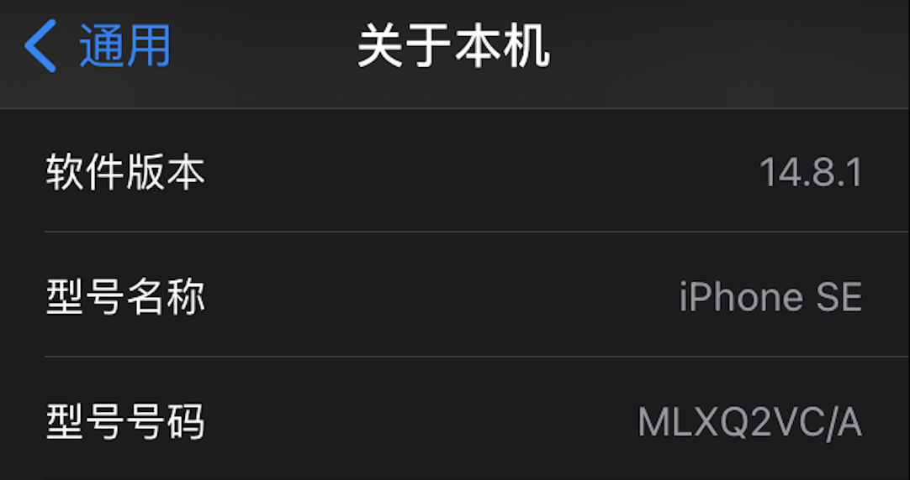

不同国家买的苹果手机外表上看都是一样的，但是怎么区分手机是哪个国家的版本呢？

型号查看步骤为： 设置->通用->关于本机->型号号码

型号是一串字母加数据组成的，如图： `MLXQ2VC/A`

这一串型号可以分为四个部分，即 "M" + "LXQ2V" + "C" + "/A"

- M 代表正常装机版零售机型。 具体分为：
  1. 正常装机版售机型"M"
  2. 官翻版零售机型"F"
  3. 定制版本机型"P"
  4. 官方换机型"N"

- LXQ2V 代表手机的型号，这里指iPhone SE 64G，具体的参数不知道怎么区分

- C 代表该手机为加拿大版本，代表销售地区，不同的国家代码不一样，下面会列出来一些

- /A 代表当前出厂时候的预设IOS系统。具体分为/A和/B
假设IOS原来出厂预设为IOS 14.8.1 ，则会标记为/A，然后在未出售之前再有苹果升级系统后，将会将/A改变成/B

| 代码 | 地区                                                                                                                                      | 代码 | 地区                                            |
|------|-----------------------------------------------------------------------------------------------------------------------------------------|--------|-----------------------------------------------|
| A    | 加拿大                                                                                                                                    | AB     | 沙特阿拉伯、阿联酋、卡塔尔、约旦、埃及              |
| B    | 英国和爱尔兰                                                                                                                              | BG     | 保加利亚                                        |
| BR   | 巴西                                                                                                                                      | BT     | 英国                                            |
| BZ   | 巴西                                                                                                                                      | C      | 加拿大                                          |
| CH   | 中国                                                                                                                                      | CI     | 巴拉圭                                          |
| CM   | 匈牙利、克罗地亚                                                                                                                           | CR     | 克罗地亚                                        |
| CS   | 斯洛伐克、捷克共和国                                                                                                                       | CN     | 斯洛伐克                                        |
| CZ   | 捷克共和国                                                                                                                                | D, DM  | 德国                                            |
| DN   | 奥地利、德国、荷兰                                                                                                                          | E      | 墨西哥                                          |
| EE   | 爱沙尼亚                                                                                                                                  | EL     | 爱沙尼亚、拉脱维亚                               |
| ER   | 爱尔兰                                                                                                                                    | ET     | 爱沙尼亚                                        |
| F    | 法国                                                                                                                                      | FB     | 法国、卢森堡                                     |
| FD   | 奥地利、列支敦士登、瑞士                                                                                                                    | FS     | 芬兰                                            |
| GB   | 希腊                                                                                                                                      | GH     | 匈牙利                                          |
| GP   | 葡萄牙                                                                                                                                    | GR     | 希腊                                            |
| HB   | 以色列                                                                                                                                    | HC     | 匈牙利、保加利亚                                 |
| IN   | 印度                                                                                                                                      | J, JP  | 日本                                            |
| IP   | 葡萄牙、意大利                                                                                                                             | ID     | 印度尼西亚                                      |
| K    | 瑞典                                                                                                                                      | KH     | 韩国、中国                                       |
| KN   | 丹麦和挪威                                                                                                                                | KS     | 芬兰和瑞典                                      |
| LA   | 危地马拉、洪都拉斯  | LE     | 阿根廷                                          |
| LL   | 美国                                                                                                                                      | LP     | 波兰                                            |
| LT   | 立陶宛                                                                                                                                    | LV     | 拉脱维亚                                        |
| LZ   | 巴拉圭、智利和乌拉圭                                                                                                                       | MG     | 匈牙利                                          |
| MM   | 黑山、阿尔巴尼亚和马其顿                                                                                                                   | MY     | 马来西亚                                        |
| ND   | 荷兰                                                                                                                                      | NF     | 比利时、法国、卢森堡、葡萄牙                       |
| PK   | 波兰、芬兰                                                                                                                                 | PL, PM | 波兰                                            |
| PO   | 葡萄牙                                                                                                                                    | PP     | 菲律宾                                          |
| PY   | 西班牙                                                                                                                                    | QB     | 俄罗斯                                          |
| QN   | 瑞典、丹麦、冰岛、挪威                                                                                                                       | QL     | 西班牙、意大利、葡萄牙                            |
| RO   | 罗马尼亚                                                                                                                                  | RP     | 俄罗斯                                          |
| RR   | 俄罗斯、摩尔多瓦                                                                                                                           | RS, RU | 俄罗斯                                          |
| RM   | 俄罗斯、哈萨克斯坦                                                                                                                         | RK     | 哈萨克斯坦                                      |
| SE   | 塞尔维亚                                                                                                                                  | SL     | 斯洛伐克                                        |
| SO   | 南非                                                                                                                                      | SU     | 乌克兰                                          |
| T    | 意大利                                                                                                                                    | TA     | 台湾                                            |
| TH   | 泰国                                                                                                                                      | TU     | 土耳其                                          |
| TY   | 意大利                                                                                                                                    | VN     | 越南                                            |
| X    | 澳大利亚、新西兰                                                                                                                           | Y      | 西班牙                                          |
| ZA   | 新加坡                                                                                                                                    | ZD     | 卢森堡 |
| ZG   | 丹麦                                                                                                                                      | ZO     | 英国                                            |
| ZP   | 香港和澳门                                                                                                                                | ZQ     | 牙买加                                          |

参考资料来源: [PakWired](https://pakwired.com/how-to-identify-your-iphone-model-and-its-country-of-origin)